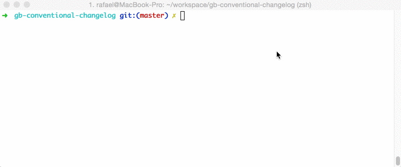

# Contributing to wukong

Pay attention BJGX-白驹过隙 team member, before you commit there is the guidelines you should follow:

 - [Set up wukong](#setup)
 - [Issues and Bugs](#issue)
 - [Commit Message Guidelines](#commit)
 - [Team workflow](#workflow)


## <a name="setup"></a> Set up wukong

If you have questions about how to set up wukong. Please read "How to run wukong" in README. 

## <a name="issue"></a> Found an Issue?
If you find a bug in the source code or a mistake in the documentation, you can help us by
submitting an issue to our [GitHub Repository][github]. 

## <a name="commit"></a> Git Commit Guidelines

> [Writing good commit messages](https://github.com/erlang/otp/wiki/Writing-good-commit-messages)

> [On commit messages](http://who-t.blogspot.com/2009/12/on-commit-messages.html)

### Our rules

We have very precise rules over how our git commit messages can be formatted.  This leads to **more
readable messages** that are easy to follow when looking through the **project history**.

We use a CLI wizard ([Commitizen](https://github.com/commitizen/cz-cli)) for commit message formatting. 
And use [rb-conventional-changelog](https://www.npmjs.com/package/rb-conventional-changelog) as the adapter of Commitizen. 

Simply use ` npm rum commit ` instead of ` git commit ` when committing in your terminal after staging your changes in git.

See short demo below:



### Commit Message Format
Each commit message consists of a **header**, a **body** and a **footer**.  The header has a special
format that includes a **type**, a **scope** and a **subject**:

```
<type>(<scope>): <subject>
<BLANK LINE>
<body>
<BLANK LINE>
<footer>
```

The **header** is mandatory and the **scope** of the header is optional.

Any line of the commit message cannot be longer 100 characters! This allows the message to be easier
to read on GitHub as well as in various git tools.

### Revert
If the commit reverts a previous commit, it should begin with `revert: `, followed by the header of the reverted commit. In the body it should say: `This reverts commit <hash>.`, where the hash is the SHA of the commit being reverted.

### Type
Must be one of the following:

* **feat**: A new feature
* **fix**: A bug fix
* **docs**: Documentation only changes
* **style**: Changes that do not affect the meaning of the code (white-space, formatting, missing
  semi-colons, etc)
* **refactor**: A code change that neither fixes a bug nor adds a feature
* **perf**: A code change that improves performance
* **test**: Adding missing tests
* **chore**: Changes to the build process or auxiliary tools and libraries such as documentation
  generation

### Scope
The scope could be anything specifying place of the commit change. For example `$location`,
`$browser`, `$compile`, `$rootScope`, `ngHref`, `ngClick`, `ngView`, etc...

### Subject
The subject contains succinct description of the change:

* use the imperative, present tense: "change" not "changed" nor "changes"
* don't capitalize first letter
* no dot (.) at the end

### Body
Just as in the **subject**, use the imperative, present tense: "change" not "changed" nor "changes".
The body should include the motivation for the change and contrast this with previous behavior.

### Footer
The footer should contain any information about **Breaking Changes** and is also the place to
reference GitHub issues that this commit **Closes**.

**Breaking Changes** should start with the word `BREAKING CHANGE:` with a space or two newlines. The rest of the commit message is then used for this.

A detailed explanation can be found in this [document][commit-message-format].

## <a name="workflow"></a> Team workflow

Before you submit your pull request to develop branch consider the following guidelines:

Instead of Merge，我们用rebase去整合代码。请先阅读下面两个资料：

* [Comparing Workflows](https://www.atlassian.com/git/tutorials/comparing-workflows/centralized-workflow)，阅读到Where To Go From Here之前的部分即可，我们基本采用这个工作流程。
* [Best Way To Merge A (GitHub) Pull Request](http://blog.differential.com/best-way-to-merge-a-github-pull-request/)

具体工作流程：

* master branch放能稳定运行的代码，
* develop branch用来我自己开发和merge 组员代码以及测试。
* 组员在自己branch开发，完成后，先__rebase__下develop的代码，再发送pull request到develop branch。
* 我们在pull request上作code review。
* develop branch稳定后merge到master。
* 另外，组长如果发现有问题需要改进，便创建issue，assign给组员。
